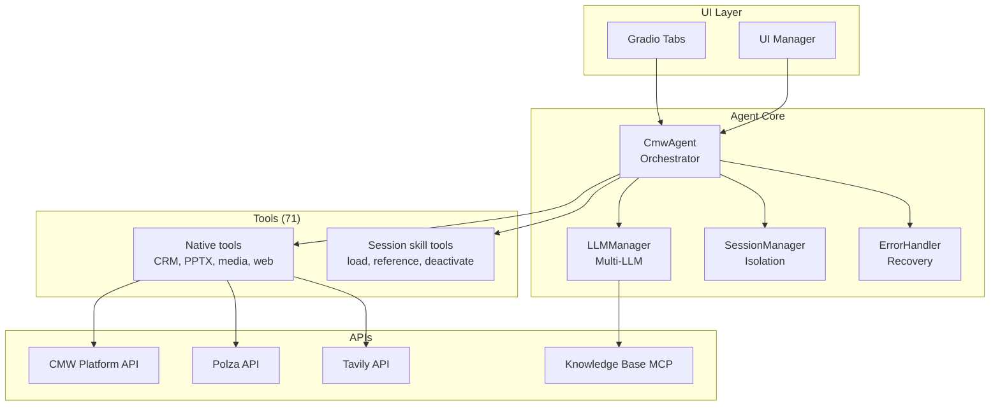

# Comindware S&M Copilot

## Overview

The Comindware Sales & Marketing Copilot is a LangChain-native AI agent for sales teams working with Comindware Platform. It prepares lead-discovery questions, transcribes and summarizes customer meetings, reviews sales presentations, researches companies on the web, and verifies platform capabilities against the Comindware knowledge base.

### Key Capabilities

- **Lead Preparation**: Read agreed lead fields by record ID and prepare exactly 10 tailored discovery questions
- **Meeting Processing**: Convert uploaded audio/video, transcribe it through Polza, and create summary and transcript Markdown files
- **Presentation Review**: Extract complete text from uploaded or bundled PPTX decks and prepare a slide-by-slide adaptation brief
- **Knowledge-Backed Answers**: Search the Comindware knowledge base through MCP before confirming platform capabilities
- **Company Research**: Search the public web through the optional Tavily integration
- **Multi-Provider LLM Support**: Manual provider and model selection with Polza configured as the default in `.env.example`
- **Multi-Turn Conversations**: Maintains context and tool call history across conversation turns
- **Real-Time Streaming**: Live response streaming with tool usage visualization
- **Session Isolation**: Each user gets isolated agent, tool, skill, memory, and file-registry state
- **Internationalization**: Full support for English and Russian UI
- **Focused Tool Suite**: CRM lookup, PPTX extraction, media transcription, artifact creation, web search, and KB retrieval

### Target Use Cases

- **Lead Discovery**: Adapt qualification questions to CRM data, company context, customer needs, and meeting transcripts
- **Meeting Follow-up**: Produce structured summaries and complete transcripts from uploaded recordings
- **Sales Presentation Preparation**: Decide which slides to keep, remove, add, or revise for a specific lead
- **Platform Feasibility Research**: Answer implementation questions using Comindware knowledge-base articles as the source of truth

## Architecture

The system uses a LangChain-native modular architecture designed for reliability and maintainability:



### Core Components

- **CmwAgent** (`langchain_agent.py`) - Main orchestrator using pure LangChain patterns
- **LLMManager** (`llm_manager.py`) - Multi-provider management with persistent instances
- **Tool System** (`tools/`) - LangChain tools
- **UI Layer** (`tabs/`) - Gradio modular tabs with real-time updates
- **Session Management** (`session_manager.py`) - User isolation and session lifecycle
- **Error Handler** (`error_handler.py`) - Vector similarity error classification
- **Memory Management** (`langchain_memory.py`) - LangChain-native conversation memory
- **Streaming System** (`native_langchain_streaming.py`) - Token-by-token streaming
- **History Compression** (`history_compression.py`) - Semantic compression to prevent context overflow

### Key Design Decisions

- **LangChain-Native**: Pure LangChain patterns ensure compatibility and future-proofing
- **Multi-Provider Support**: Manual provider selection with context preservation
- **Session Isolation**: User data separation and clean conversation contexts
- **Modular Architecture**: Clear separation of concerns for maintainability

## CMW Platform Integration

The agent provides comprehensive integration with the CMW Platform through specialized tools.

### Tool Categories

**Utility Tools**

- **Knowledge base**: `get_knowledge_base_articles` retrieves Comindware articles and is the source of truth for platform capabilities

**Project Skills**

- `cmw-prepare-lead-questions`
- `cmw-plan-sales-presentation`
- `cmw-summarize-meeting`

## LLM Provider System

The agent supports multiple LLM providers with manual selection. The active provider is selected through `AGENT_PROVIDER`; `.env.example` uses Polza.

### Supported Providers

- **Polza** - European AI models with tool support
- **GigaChat** - Russian language models with tool support

### Provider Management

- Manual provider selection through UI
- Context preservation when switching providers
- Sophisticated error classification and recovery suggestions
- Provider-specific error handling and retry timing
- Session-based provider state management

## Getting Started

### Prerequisites

- Python 3.14+
- FFmpeg with both `ffmpeg` and `ffprobe` available in the process `PATH`
- CMW Platform URL and credentials when CRM record lookup is required
- A Polza API key for the default LLM configuration and media transcription, or another configured LLM provider key for chat

### Installation

1. **Setup**:

   ```bash
   pip install -r requirements.txt
   ```

   FFmpeg is a system runtime dependency and is not installed by
   `pip install -r requirements.txt`. Install it separately:

   Windows (Scoop):

   ```powershell
   scoop install ffmpeg
   ```

   Debian / Ubuntu:

   ```bash
   sudo apt install ffmpeg
   ```

   Verify that both executables are available to the process that will run
   the agent:

   ```bash
   ffmpeg -version
   ffprobe -version
   ```

2. **Configure environment**:

   ```bash
   export POLZA_API_KEY= = <YOUR_API_KEY>
   export CMW_DEFAULT_LANGUAGE="ru"
   ```

3. **Run the application**:

   ```bash
   python agent_ng/app_ng_modular.py
   ```

### Basic Configuration

Configure the runtime through `.env` (see `.env.example`):

- `POLZA_API_KEY`, `AGENT_PROVIDER`, and `AGENT_DEFAULT_MODEL` for the default LLM route
- `CMW_BASE_URL`, `CMW_LOGIN`, and `CMW_PASSWORD` for CRM record lookup
- `CMW_MCP_ENABLED=true` to load servers from `config/mcp_servers.yaml`
- `CMW_WEB_SEARCH_ENABLED=true` and `TAVILY_API_KEY` for web search

The CRM tool only reads fields requested by the active skill; it does not provide general platform administration.

### Tavily Web Search

Web search is optional and disabled by default. Set both values in the process
environment or local `.env`:

```dotenv
CMW_WEB_SEARCH_ENABLED=true
TAVILY_API_KEY=tvly-your-key
```

Restart the application after changing either value because the native tool
list is cached. The search profile is fixed to Tavily `basic`, returns at most
five results, and costs 1 Tavily credit per request. `country="russia"` boosts
Russian results but is not a strict geographic filter.

Run the opt-in live smoke test from the current runtime environment:

```powershell
$env:CMW_TAVILY_INTEGRATION_TESTS = "1"
.\.venv\Scripts\python.exe -m pytest `
  agent_ng/_tests/test_tavily_live_integration.py -q
Remove-Item Env:CMW_TAVILY_INTEGRATION_TESTS
```

The smoke test makes one real Tavily request and does not call an LLM. For a
full agent check, ask the agent to use `web_search` for current information and
include the source URLs in its answer.

If search is unavailable, check the stable error code:

- `authentication_failed`: verify `TAVILY_API_KEY`;
- `rate_limit`: wait for the request-per-minute limit to reset;
- `plan_limit` or `paygo_limit`: check Tavily account limits;
- `service_unavailable`: retry after the network or Tavily service recovers.

Never put a real API key in source files or logs.

## Key Features

### Multi-Turn Conversations

- LangChain-native memory management with `ConversationBufferMemory`
- Tool call context preservation across conversation turns
- Session-specific memory instances

### Real-Time Streaming

- Token-by-token streaming using LangChain's `astream()` and `astream_events()`
- Tool usage visualization with real-time updates
- No artificial delays - uses LangChain's built-in streaming capabilities

### Session Isolation

- User-specific agent instances with separate tools, skills, memory, and file registries
- Session-based file handling and resource management
- In-process session state for the lifetime of the running application; inactive-session cleanup is not yet implemented

### File Upload & Analysis

Files uploaded through Gradio's `MultimodalTextbox` are registered in a session-isolated registry. The currently bound tools process:

- **Presentations**: PPTX files through `extract_presentation_slides`
- **Meeting recordings**: supported audio/video files through `transcribe_uploaded_media`
- **Generated artifacts**: Markdown meeting summaries and transcripts through `save_meeting_markdown`

Uploading another file type does not imply that the agent has a tool capable of parsing it.

### Internationalization

- Full support for English and Russian languages
- Dynamic language switching using Gradio's I18n system
- Complete UI component translations

### Error Recovery

- Vector similarity for error pattern matching
- Sophisticated error classification and recovery suggestions
- Manual provider switching with context preservation
- Graceful degradation when components fail

### Token Budget Tracking & Cost Management

- **Accurate Token Counting**: Uses `tiktoken` with `cl100k_base` encoding, with API-reported tokens prioritized as ground truth
- **Real-Time Budget Snapshots**: Computed at key decision points for immediate visibility
- **Token Breakdown Display**: Three components shown:
  - **Context**: Conversation messages (system, user, assistant) - excludes tool results
  - **Tools**: Tool result messages (ToolMessage content) returned by executed tools
  - **Overhead**: Tool schemas sent with every LLM call (constant per tool set, ~600 tokens per tool)
- **Cost Tracking**: Uses provider-reported usage and cost data when available; provider-specific adapters normalize values for the UI
- **Multi-Level Statistics**: 
  - Per-turn cost and token counts (displayed in chat after each QA turn, including zero cost)
  - Per-conversation totals (session-scoped) with integrated cost display
  - Overall totals (across all conversations) with cost tracking
- **Input/Output Breakdown**: Token counts separated by input/output in stats pane
- **Overhead Adjustment Factor** (`OVERHEAD_ADJUSTMENT_FACTOR = 0.8`): Heuristic factor applied to tool schema overhead to better match API-reported tokens, compensating for differences between `tiktoken` and provider tokenization
- **Event-Driven UI Updates**: Immediate budget and cost visibility without polling

**Note**: Estimates may differ from billed values because tokenization and cost metadata vary by provider. API-reported values take priority when available.

### History Compression

- **Semantic Compression**: Automatically compresses conversation history when token usage approaches critical thresholds (≥90%)
- **Proactive Compression**: Mid-turn compression prevents context overflow before it occurs
- **UI Safety**: Compression only affects agent memory (for LLM context), not UI display or downloaded history files
- **Smart Preservation**: Keeps recent conversation turns uncompressed to maintain context
- **User Notifications**: Gradio popups show compression status and token savings
- **Compression Stats**: Track compression count and total tokens saved per conversation
- **Error Handling**: Graceful degradation - continues with uncompressed history on failure
 - **Configurable**: History compression can be toggled per-session in the sidebar and globally via `HISTORY_COMPRESSION_ENABLED` env flag (see `.env.example`)

### Debug System

- Real-time debug output with categorized logging
- Performance metrics and usage analytics

## Technical Stack

### Core Framework

- **LangChain** - AI framework with native conversation management
- **Gradio** - Modern web UI with modular tab architecture
- **Pydantic** - Data validation and serialization

### Key Libraries

- `requests` - HTTP client for API calls
- `pandas` - Data analysis and CSV processing
- `pillow` - Image processing and manipulation
- `tiktoken` - Token counting and optimization
- `python-dotenv` - Environment variable management

## Troubleshooting

### Common Issues

1. **LLM Not Loading**
   - Check API keys in environment variables
   - Verify provider availability and rate limits
   - Check network connectivity

2. **Tool Calls Failing**
   - Verify CMW Platform connection in Config tab
   - Check tool permissions and platform access
   - Review error logs in the configured log file or console

3. **Session Issues**
   - Clear browser cache and restart application
   - Check session isolation in debug logs
   - Check session isolation and lifecycle events in debug logs

4. **Memory Issues**
   - Check session-specific memory instances
   - Verify conversation context preservation
   - Monitor token usage and limits

5. **Streaming Problems**
   - Verify LangChain version compatibility
   - Check streaming configuration
   - Monitor real-time debug output

### Debug Mode

Enable detailed logging:
```bash
export CMW_DEBUG_MODE=true
export CMW_VERBOSE_LOGGING=true
```

Check the configured log file or console output for detailed error traces and execution flow.

## Development

### Adding New Tools
1. Create tool function in appropriate category directory
2. Define a clear Pydantic input schema next to the tool when needed
3. Export the tool from its category package and register that package in `LLMManager.get_tools()`
4. Test with various LLM providers

### Adding New LLM Providers
1. Add provider enum to `LLMProvider` in `llm_manager.py`
2. Add configuration to `LLM_CONFIGS`
3. Implement provider-specific initialization
4. Test with tool calling and streaming

### Code Style
- Follow LangChain patterns and conventions
- Use Pydantic for data validation
- Run linter: `ruff check agent_ng/ tools/`
- Fix all linting issues: `ruff check --fix --unsafe-fixes agent_ng/ tools/`

## Documentation

- **[API Schemas](cmw_open_api/)** - Complete OpenAPI specifications for CMW Platform integration
- **[Implementation Reports](docs/)** - Detailed progress reports and technical analysis

## Contributing

This is an experimental research project. Contributions are welcome in the form of:

- **Bug Reports** - Issues with agent reasoning or tool usage
- **Feature Requests** - New tools or capabilities for CMW Platform integration
- **Performance Improvements** - Optimizations for speed or accuracy
- **Documentation** - Improvements to guides and code comments

### Development Setup

1. **Create and activate virtual environment**:

   Linux / Mac:
   ```bash
   python3 -m venv .venv
   source .venv/bin/activate
   ```

   WSL (separate venv so Windows and WSL can run in parallel):
   ```bash
   python3 -m venv .venv-wsl   # or .venv-ubuntu
   source .venv-wsl/bin/activate
   ```

   Windows (PowerShell):
   ```powershell
   python -m venv .venv
   .venv\Scripts\Activate.ps1
   ```

2. **Install dependencies**:
   ```bash
   pip install -r requirements.txt
   ```

3. **Configure environment**:
   ```bash
   cp .env.example .env
   # Edit .env and set at least one LLM provider API key
   ```

4. **Run the application**:
   ```bash
   python agent_ng/app_ng_modular.py
   # Gradio UI starts on the port configured by GRADIO_DEFAULT_PORT in .env (default 7860)
   ```
   The app starts even without valid API keys (the UI is fully functional; chat requests return auth errors until a valid key is configured).

5. **Run linter**:
   ```bash
   ruff check agent_ng/ tools/      # Lint core directories
   python lint.py                    # Lint only changed files vs HEAD
   python lint.py --all              # Lint entire repo
   ```

6. **Run tests**:
   ```bash
   python -m pytest agent_ng/_tests/           # All tests
   python -m pytest agent_ng/_tests/test_x.py  # Single file
   python -m pytest -k "pattern"               # Filter by name
   ```
   Live integration tests require their explicit opt-in environment flags and access to the corresponding external service; they are skipped by default.

7. **Typecheck**:
   ```bash
   mypy agent_ng/
   ```

### External Services

- **LLM providers**: At least one configured provider key is needed for chat. The current default route uses `POLZA_API_KEY`; see `.env.example` for alternatives.
- **Polza transcription**: Meeting transcription uses `POLZA_API_KEY` and `POLZA_BASE_URL`.
- **CMW Platform** (optional): CRM record lookup requires `CMW_BASE_URL`, `CMW_LOGIN`, and `CMW_PASSWORD`.
- **Knowledge-base MCP** (optional): Enable with `CMW_MCP_ENABLED=true`; server configuration lives in `config/mcp_servers.yaml`.
- **Tavily** (optional): Web research requires both `CMW_WEB_SEARCH_ENABLED=true` and `TAVILY_API_KEY`.
- **No Docker, databases, or message queues** are required. The app is a single Python process.
